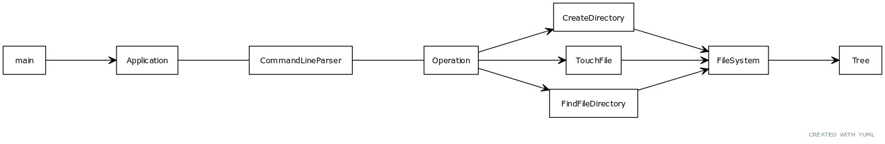

# Virtual File System

[](https://github.com/h0lyalg0rithm/vfs/actions/workflows/build.yaml)
[](https://github.com/h0lyalg0rithm/vfs/releases)

The _vfs_ is a solution to the technical assignment.

## Motivation

The goal of this application is to emulate specific commands similar to a file system

## Installation

### If you have cmake install
```bash
cmake .   
make
./app
```

### If you want to build it manually
```bash
chmod +x build.sh
./build.sh
./app
```

## Architecture
The goal is to ensure the communication flow is in one direction.All class follow the SRP principle.
Interfaces are used to define the boundaries between the different entities.

